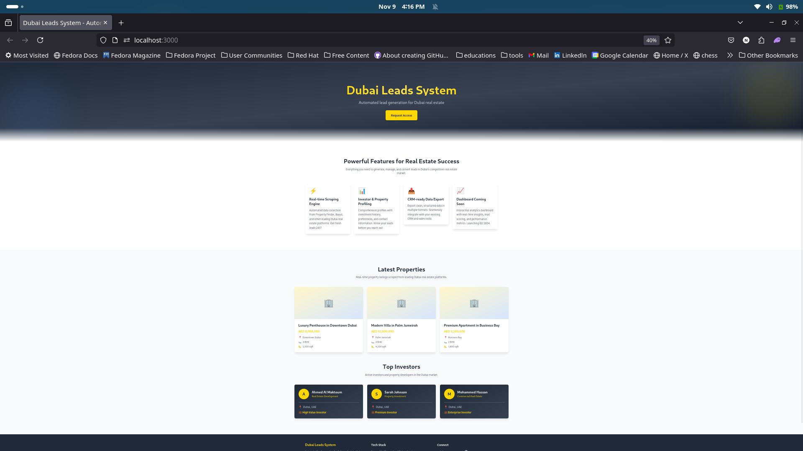

# Dubai Leads System

A modern, responsive landing page for an automated real estate lead generation system focused on Dubai properties.

## Screenshot



> **Note:** To add a screenshot:
> 1. Take a screenshot of your landing page (full page or hero section)
> 2. Save it as `screenshot.png` in the `public/images/` directory
> 3. The image will automatically appear above

## Features

- 🎨 Modern, responsive design with Dubai-inspired color palette (gold, white, dark gray)
- 🚀 Built with Next.js 14 and Tailwind CSS
- 📱 Fully responsive across all devices
- 🏢 Property cards showcasing latest listings
- 👥 Investor cards displaying top investors
- ✨ Smooth animations and hover effects

## Getting Started

First, install the dependencies:

```bash
npm install
```

Then, run the development server:

```bash
npm run dev
```

Open [http://localhost:3000](http://localhost:3000) with your browser to see the result.

## Project Structure

```
├── app/
│   ├── globals.css      # Global styles with Tailwind
│   ├── layout.tsx       # Root layout
│   └── page.tsx         # Main landing page
├── components/
│   ├── Hero.tsx         # Hero section with CTA
│   ├── Features.tsx     # Features and coming soon section
│   ├── PropertyCards.tsx # Latest properties display
│   ├── InvestorCards.tsx # Top investors display
│   └── Footer.tsx       # Footer with GitHub link
└── ...
```

## Tech Stack

- **Next.js 14** - React framework
- **TypeScript** - Type safety
- **Tailwind CSS** - Utility-first CSS framework
- **React** - UI library

## Color Palette

- **Dubai Gold**: `#FFD700` - Primary accent color
- **Charcoal**: `#1F2937` - Background and text
- **White**: `#FFFFFF` - Clean, modern backgrounds
- **Accent Blue**: `#3B82F6` - Secondary accent color

## Future Enhancements

- Connect to backend scrapers for dynamic data
- Add dashboard functionality
- Integrate CRM systems
- Implement analytics and reporting


